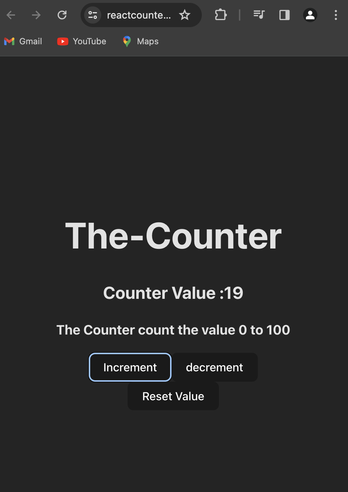

# React Counter Project 

### Overview

The React Counter project is a simple web application that utilizes React, useState for state management, Vite for fast development, and Vercel for deployment. The primary goal of this project is to showcase the use of React state management and the seamless deployment process with Vercel.

### Demo :



### You can Check it Live on Below Link :

[Live Link !](https://reactcounter-sigma.vercel.app/)


### Features

- Counter: A basic counter functionality allowing users to increment, decrement, and reset the counter.
- State Management: Utilizes React's useState hook for managing the state of the counter.
- Fast Development: Developed using Vite for a fast and efficient development experience.
- Deployment: Deployed seamlessly with Vercel, making it easy to share the project with others.


### Technologies Used

- React: A JavaScript library for building user interfaces.
- Vite: A build tool that aims to provide a faster and more efficient development experience for web projects.
- Vercel: A cloud platform for static sites and serverless functions, enabling easy deployment

### Installation

To run the project locally, follow these steps:


1. Clone the repository: 

```
git clone [repository-url]
cd react-counter


```

2. Install dependencies:

```

npm install

```

3. Run the development server:

```
npm run dev

```
The project will be accessible at http://localhost:3000.


### Usage
1. Open the project in a web browser.
2. Interact with the counter:
- Click "Increment" to increase the counter.
- Click "Decrement" to decrease the counter.
- Click "Reset" to reset the counter to zero.

Deployment

The React Counter project is deployed using Vercel. Any changes pushed to the main branch are automatically deployed.

 [Live Demo !](https://reactcounter-sigma.vercel.app/)


 #### Contributing
If you'd like to contribute to the project, please follow these steps:

- Fork the repository.
- Create a new branch for your feature or bug fix.
- Make your changes and submit a pull request.